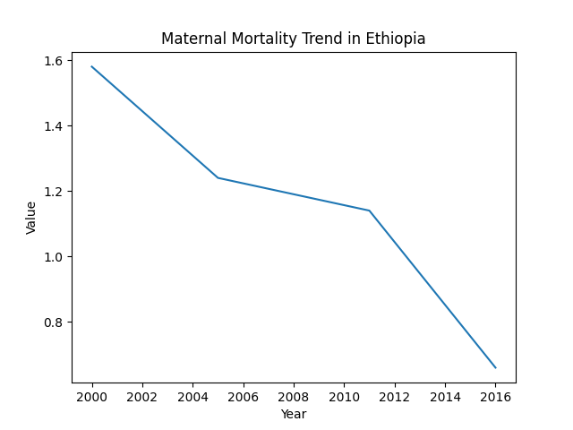

# 📊 Maternal Mortality Trend in Ethiopia (DHS/HDX Data Analysis)

## 🎯 Objective
This project analyzes the trend of maternal mortality in Ethiopia using DHS/HDX survey data. The goal is to understand how maternal mortality changes over time and compute the rate of change between survey periods.

---

## 🧠 Research Question
How has maternal mortality in Ethiopia changed across survey years, and what is the rate and direction of that change?

---

## 📦 Dataset
- Source: DHS / HDX (Demographic and Health Surveys)
- Country: Ethiopia (ISO3: ETH)
- Main indicator:
  - Pregnancy-related mortality rate

---

## ⚙️ Methodology

### Data Processing
- Load raw DHS dataset using Pandas
- Filter for: `Pregnancy-related mortality rate`
- Keep relevant fields: `SurveyYear`, `Value`
- Sort data chronologically

### Feature Engineering
- `change` → difference between consecutive values
- `year_gap` → time difference between survey years
- `rate_of_change` → normalized change per year

---

## 📉 Key Insight
Maternal mortality in Ethiopia shows a **general decreasing trend over time**, but the decline is **not perfectly linear**, indicating variation across survey periods.

---

## 📊 Output Visualization

The trend visualization generated by the project is shown below:



---
## 🧠 Interpretation of Results

The analysis shows that maternal mortality in Ethiopia follows a **general downward trend across survey years**. This suggests gradual improvement in maternal health outcomes over time.

However, the decline is **not smooth or linear**. Some intervals show faster reductions while others show slower progress. This inconsistency is mainly due to:
- Irregular spacing between survey years
- Limited number of observation points
- External socio-economic and healthcare system factors not captured in the dataset

Overall, the trend indicates **positive progress**, but not steady or predictable improvement.

---

## 🔭 Future Improvements

### 📈 Advanced Analysis
- Apply statistical trend models (linear regression, polynomial regression)
- Add time-series forecasting (ARIMA / Prophet)
- Compute confidence intervals for mortality estimates

### 🌍 Comparative Study
- Compare Ethiopia with other East African countries
- Benchmark against regional maternal health indicators

### 📊 Better Visualization
- Add interactive dashboards (Plotly / Streamlit)
- Include uncertainty bands in trend plots
- Create year-gap normalized trend visualization

### 🧠 Data Enhancement
- Integrate additional socio-economic indicators (GDP, healthcare access, education)
- Combine DHS data with World Bank indicators for deeper insights

### 🏗️ Engineering Improvements
- Convert notebook into fully modular pipeline (no notebook dependency)
- Add unit tests for data processing functions
- Improve logging and error handling in `run.py`

---

## 🚧 Key Limitation Reminder
This analysis is constrained by:
- Sparse survey-based data points
- Non-continuous time series
- Limited causal variables in the dataset


---

## 🚀 How to Run

```bash
git clone https://github.com/girum07/maternal-mortality-ethiopia.git
cd maternal-mortality-ethiopia

python3 -m venv .venv
source .venv/bin/activate

pip install pandas matplotlib

python3 run.py 
